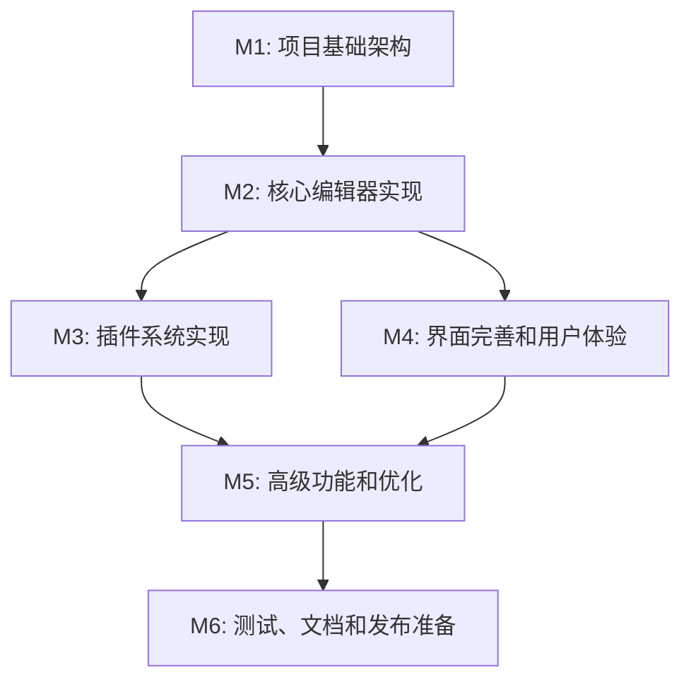

# LitePad 里程碑文档

## 项目概览

**项目名称**：LitePad - 轻量级代码编辑器
**开发周期**：6 个月（2025 年 08 月 - 2026 年 01 月）
**项目类型**：开源软件项目
**开发团队**：目前仅个人开发，期待加入~
**开发方法**：敏捷开发，闲暇之余，不定期迭代，能力越小责任越小！

### 评审委员会

| 职位           | 成员            |
| -------------- | --------------- |
| 评审委员会主席 | `echo.green`    |
| 技术专家组     | `cuilan` `null` |
| 提案委员会     | `null`          |

## 里程碑规划

```
Scaffolding
    ↓
Development → SNAPSHOT → M1 → Alpha (internal)
                      |→ M2 → Alpha → Beta (public)
                      |→ M3 → Alpha → Beta → RC1 → RC2 → GA (Stable)
                      |→ M4 → ......
                      |→ M5 → ......
                      |→ M6 → ...... → GA (Stable)
                      |→ Hotfix → RELEASE → LTS
 ```

### 🏃 孵化 & ：早期阶段

**时间范围**：2025 年 07 月 - 2025 年 08 月
**状态**：✅ 已完成
**完成度**：100%

#### 目标

项目构思：确定项目的目标、愿景和要解决的问题。
需求分析 (Requirements Analysis)：收集和定义高级功能需求。
技术选型与设计 (Architecture Design)：决定技术栈（语言、框架），并构思设计软件的整体架构。
排期规划：制定开发任务与工期。

#### 主要交付物

- ✅ 需求描述文档
- ✅ 技术选型文档
- ✅ 验收测试文档

### 🏁 里程碑 1：项目基础架构 (M1)

**时间范围**：2025 年 08 月 - 2024 年 12 月
**状态**：✅ 已完成  
**完成度**：100%

#### 目标

建立项目的基础架构和开发环境，完成核心类的设计和接口定义。

#### 主要交付物

- [x] 项目目录结构设计
- [x] Git 版本控制配置
- [x] CMake 构建系统配置
- [x] 跨平台构建脚本（Windows/macOS/Linux）
- [x] 核心类头文件设计
  - [x] Editor 类接口定义
  - [x] PluginInterface 插件接口
  - [x] ConfigManager 配置管理器
  - [x] PluginManager 插件管理器
  - [x] MainWindow 主窗口类
- [x] 基础插件接口设计
  - [x] LineNumberPlugin 行号插件
  - [x] SyntaxHighlightPlugin 语法高亮插件
  - [x] AutoSavePlugin 自动保存插件
  - [x] TerminalPlugin 终端插件
- [x] 测试框架搭建
- [x] 项目文档初始化

#### 验收标准

- [x] 项目能够在三大平台成功构建
- [x] 所有核心类接口设计完整
- [x] 代码结构清晰，符合设计规范
- [x] 基础文档完整

#### 风险与挑战

- ✅ 跨平台构建配置复杂性 - 已解决
- ✅ 插件系统架构设计 - 已完成
- ✅ 依赖库选择和管理 - 已确定使用平台原生 GUI

---

### 🚧 里程碑 2：核心编辑器实现 (M2)

**时间范围**：2025 年 1 月 - 2025 年 2 月  
**状态**：🔄 进行中  
**完成度**：0%  
**预计开始**：2025 年 1 月 1 日  
**预计完成**：2025 年 2 月 15 日

#### 目标

实现编辑器的核心功能，包括文本编辑、文件操作、基础界面等。

#### 主要交付物

- [ ] Editor 类完整实现
  - [ ] 文本编辑功能（增删改查）
  - [ ] 文件操作（打开、保存、另存为）
  - [ ] 撤销/重做机制
  - [ ] 查找替换功能
  - [ ] 内容变化通知机制
- [ ] ConfigManager 配置系统实现
  - [ ] 配置文件读写
  - [ ] 配置项管理
  - [ ] 默认配置处理
  - [ ] 配置变化通知
- [ ] 基础 GUI 框架搭建
  - [ ] 主窗口基础界面
  - [ ] 文本编辑区域
  - [ ] 菜单栏和工具栏
  - [ ] 状态栏
- [ ] 跨平台窗口系统实现
  - [ ] Windows 平台窗口
  - [ ] macOS 平台窗口
  - [ ] Linux 平台窗口

#### 验收标准

- [ ] 能够打开、编辑、保存文本文件
- [ ] 基础编辑操作正常工作
- [ ] 撤销重做功能正确
- [ ] 查找替换功能可用
- [ ] 配置系统正常工作
- [ ] 三平台界面正常显示

#### 关键任务

1. **Week 1-2**：实现 Editor 类的文件操作功能
2. **Week 3-4**：实现文本编辑和撤销重做机制
3. **Week 5-6**：实现 ConfigManager 配置系统
4. **Week 7-8**：搭建基础 GUI 界面

#### 风险与挑战

- ⚠️ 跨平台 GUI 实现复杂度
- ⚠️ 大文件处理性能优化
- ⚠️ 内存管理和资源释放
- ⚠️ 字符编码处理

---

### 🎯 里程碑 3：插件系统实现 (M3)

**时间范围**：2025 年 2 月 - 2025 年 3 月  
**状态**：⏳ 待开始  
**完成度**：0%  
**预计开始**：2025 年 2 月 16 日  
**预计完成**：2025 年 3 月 31 日

#### 目标

实现完整的插件系统，包括插件加载、管理和基础插件实现。

#### 主要交付物

- [ ] PluginManager 插件管理器实现
  - [ ] 插件动态加载机制
  - [ ] 插件生命周期管理
  - [ ] 插件依赖关系处理
  - [ ] 插件配置管理
- [ ] 基础插件实现
  - [ ] LineNumberPlugin 行号显示插件
  - [ ] SyntaxHighlightPlugin 语法高亮插件
  - [ ] AutoSavePlugin 自动保存插件
  - [ ] TerminalPlugin 集成终端插件
- [ ] 插件开发文档
  - [ ] 插件开发指南
  - [ ] API 参考文档
  - [ ] 示例插件代码

#### 验收标准

- [ ] 插件系统能够正常加载和卸载插件
- [ ] 所有基础插件功能正常
- [ ] 插件配置系统工作正常
- [ ] 插件开发文档完整

#### 关键任务

1. **Week 1-2**：实现插件动态加载机制
2. **Week 3-4**：实现行号和语法高亮插件
3. **Week 5-6**：实现自动保存和终端插件
4. **Week 7-8**：完善插件系统和编写文档

#### 风险与挑战

- ⚠️ 跨平台动态库加载差异
- ⚠️ 插件安全性和稳定性
- ⚠️ 插件接口设计的扩展性
- ⚠️ 语法高亮算法复杂度

---

### 🎨 里程碑 4：界面完善和用户体验 (M4)

**时间范围**：2025 年 4 月 - 2025 年 4 月  
**状态**：⏳ 待开始  
**完成度**：0%  
**预计开始**：2025 年 4 月 1 日  
**预计完成**：2025 年 4 月 30 日

#### 目标

完善用户界面，提升用户体验，实现主题系统和界面定制功能。

#### 主要交付物

- [ ] 完整的用户界面
  - [ ] 现代化的界面设计
  - [ ] 多标签页文件管理
  - [ ] 文件浏览器面板
  - [ ] 搜索结果面板
  - [ ] 设置对话框
- [ ] 主题系统
  - [ ] 明亮主题
  - [ ] 暗黑主题
  - [ ] 自定义主题支持
  - [ ] 主题切换功能
- [ ] 用户体验优化
  - [ ] 快捷键系统
  - [ ] 右键菜单
  - [ ] 拖拽支持
  - [ ] 最近文件列表
  - [ ] 会话恢复功能

#### 验收标准

- [ ] 界面美观，符合现代设计标准
- [ ] 多文件编辑功能正常
- [ ] 主题切换流畅
- [ ] 快捷键响应正确
- [ ] 用户操作体验良好

#### 关键任务

1. **Week 1**：设计和实现多标签页界面
2. **Week 2**：实现文件浏览器和搜索面板
3. **Week 3**：开发主题系统
4. **Week 4**：用户体验优化和测试

#### 风险与挑战

- ⚠️ 界面设计的跨平台一致性
- ⚠️ 主题系统的性能影响
- ⚠️ 复杂界面的内存占用
- ⚠️ 用户习惯和期望管理

---

### 🔧 里程碑 5：高级功能和优化 (M5)

**时间范围**：2025 年 5 月 - 2025 年 5 月  
**状态**：⏳ 待开始  
**完成度**：0%  
**预计开始**：2025 年 5 月 1 日  
**预计完成**：2025 年 5 月 31 日

#### 目标

实现高级功能，进行性能优化，完善错误处理和稳定性。

#### 主要交付物

- [ ] 高级编辑功能
  - [ ] 代码折叠
  - [ ] 智能缩进
  - [ ] 括号匹配
  - [ ] 代码提示（基础版）
  - [ ] 多光标编辑
- [ ] 性能优化
  - [ ] 大文件处理优化
  - [ ] 内存使用优化
  - [ ] 启动速度优化
  - [ ] 渲染性能优化
- [ ] 稳定性改进
  - [ ] 异常处理机制
  - [ ] 崩溃恢复功能
  - [ ] 内存泄漏检测和修复
  - [ ] 多线程安全改进

#### 验收标准

- [ ] 高级编辑功能正常工作
- [ ] 大文件（>100MB）处理流畅
- [ ] 内存占用在合理范围内
- [ ] 程序稳定性良好
- [ ] 异常情况处理正确

#### 关键任务

1. **Week 1**：实现代码折叠和智能缩进
2. **Week 2**：大文件处理性能优化
3. **Week 3**：内存和启动速度优化
4. **Week 4**：稳定性测试和改进

#### 风险与挑战

- ⚠️ 性能优化的复杂度
- ⚠️ 多线程编程的复杂性
- ⚠️ 内存管理的精确性
- ⚠️ 兼容性测试的全面性

---

### 🚀 里程碑 6：测试、文档和发布准备 (M6)

**时间范围**：2025 年 6 月 - 2025 年 6 月  
**状态**：⏳ 待开始  
**完成度**：0%  
**预计开始**：2025 年 6 月 1 日  
**预计完成**：2025 年 6 月 30 日

#### 目标

完成全面测试，完善文档，准备正式发布。

#### 主要交付物

- [ ] 完整的测试套件
  - [ ] 单元测试（覆盖率>80%）
  - [ ] 集成测试
  - [ ] 性能测试
  - [ ] 跨平台兼容性测试
  - [ ] 用户接受度测试
- [ ] 完整的文档体系
  - [ ] 用户手册
  - [ ] 开发者文档
  - [ ] API 参考文档
  - [ ] 插件开发指南
  - [ ] 安装部署文档
- [ ] 发布准备
  - [ ] 安装包制作
  - [ ] 发布流程自动化
  - [ ] 版本管理规范
  - [ ] 社区支持准备

#### 验收标准

- [ ] 所有测试通过
- [ ] 文档完整准确
- [ ] 安装包正常工作
- [ ] 发布流程验证成功
- [ ] 社区反馈机制建立

#### 关键任务

1. **Week 1**：完善单元测试和集成测试
2. **Week 2**：跨平台兼容性测试
3. **Week 3**：完善文档和制作安装包
4. **Week 4**：发布准备和社区建设

#### 风险与挑战

- ⚠️ 测试覆盖的全面性
- ⚠️ 文档的准确性和完整性
- ⚠️ 发布流程的可靠性
- ⚠️ 社区建设的持续性

---

## 里程碑依赖关系



## 关键指标监控

### 开发进度指标

- **代码提交频率**：每周至少 10 次提交
- **功能完成率**：按里程碑计划完成度
- **代码覆盖率**：单元测试覆盖率目标 80%
- **缺陷密度**：每千行代码缺陷数<5 个

### 质量指标

- **构建成功率**：>95%
- **测试通过率**：>98%
- **性能指标**：启动时间<2s，内存占用<50MB
- **稳定性指标**：连续运行 24 小时无崩溃

### 文档指标

- **API 文档覆盖率**：>90%
- **用户文档完整性**：所有功能有对应说明
- **开发文档更新及时性**：代码变更后 24 小时内更新

## 风险管理

### 高风险项目

1. **跨平台 GUI 实现**

   - 风险等级：高
   - 影响：可能导致开发周期延长
   - 缓解措施：提前原型验证，分平台并行开发

2. **插件系统稳定性**

   - 风险等级：中
   - 影响：可能影响整体稳定性
   - 缓解措施：充分测试，沙箱机制

3. **性能优化复杂度**
   - 风险等级：中
   - 影响：可能无法达到性能目标
   - 缓解措施：分阶段优化，性能测试驱动

### 应急预案

- **里程碑延期**：调整后续里程碑时间，或削减非核心功能
- **技术难题**：寻求社区帮助，考虑技术方案替代
- **资源不足**：优先实现核心功能，延后高级功能

## 成功标准

### 项目成功标准

- [ ] 所有里程碑按时完成
- [ ] 核心功能完整实现
- [ ] 三大平台正常运行
- [ ] 插件系统正常工作
- [ ] 性能指标达到要求
- [ ] 文档体系完整
- [ ] 社区初步建立

### 质量成功标准

- [ ] 单元测试覆盖率>80%
- [ ] 集成测试通过率>95%
- [ ] 用户接受度测试满意度>85%
- [ ] 代码审查通过率 100%
- [ ] 安全扫描无高危漏洞

---

**文档版本**：v0.1.0
**创建日期**：2025 年 08 月
**最后更新**：2025 年 08 月
**负责人**：LitePad 项目者
**审核状态**：待审核
**下次评审**：2025 年 09 月 01 日
